# todoList
> TodoList 代办清单-同济大学 Web Programming 期末作业。功能：1. 包含新增、删除、展现列表、全部完成/取消、删除已完成  2. 保存页面状态，刷新页面后可恢复；附加功能：1. 编辑单条 todo 2. 设置截止时间 3. 根据时间排序列出todo安排
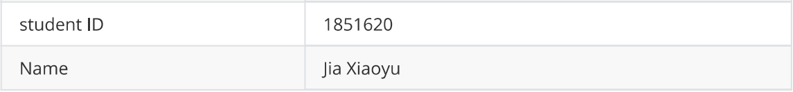

部署地址：https://hengqu4.github.io/todoList/

* [todoList](#todolist)
  * [Item列表](#item列表)
    * [增加Item](#增加item)
    * [删除Item](#删除item)
    * [编辑Item](#编辑item)
    * [完成Item](#完成item)
  * [Item整体操作](#item整体操作)
    * [全部完成](#全部完成)
    * [全部取消](#全部取消)
    * [清空列表](#清空列表)
    * [删除已完成](#删除已完成)
  * [Item过滤](#item过滤)
    * [All](#all)
    * [Completed](#completed)
    * [Active](#active)
  * [Item 排序](#item-排序)
    * [时间排序](#时间排序)
    * [事项排序](#事项排序)
  * [Item搜索](#item搜索)
  * [Item风格](#item风格)
    * [超时Item](#超时item)
    * [主题风格](#主题风格)
    * [页面总览](#页面总览)

## Item列表

### 增加Item

点击按钮Add new Item

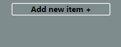

输入Item的名称和截止日期，点击确定按钮

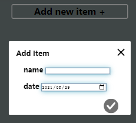

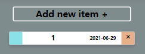

### 删除Item

点击item右侧的`x`

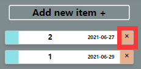

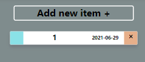

### 编辑Item

点击item的名称或者截止日期进行修改，即白色区域

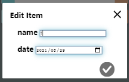

### 完成Item

点击item左侧的蓝色小方块

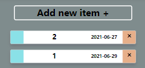

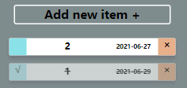

## Item整体操作

### 全部完成

点击顶部操作栏的第一个icon

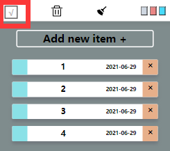

可以看到所有item呈现完成状态

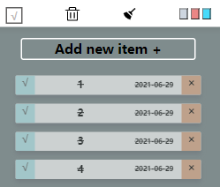

### 全部取消

再次点击顶部操作栏的第一个icon

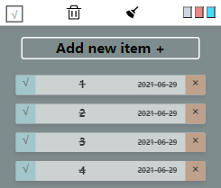

将会全部取消

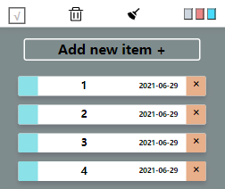

如果item没有全部完成，按钮将表现为全部勾选完成；

如果item已经全部完成，按钮将表现为全部取消。

### 清空列表

点击顶部操作栏第二个按钮

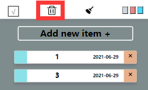

将会清空item列表

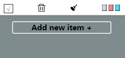

### 删除已完成

点击顶部操作栏第三个按钮

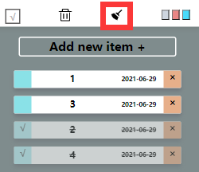

将会删除已完成的item，在本样例中为2和4

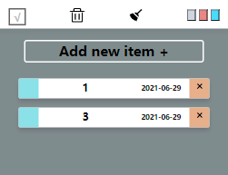

## Item过滤

### All

点击底部栏左侧的第一个按钮，将会显示所有Item，包括已经完成的和正在进行的。

在本例中为1、2、3、4、5。

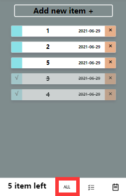

### Completed

点击底部栏左侧的第二个按钮，将会显示所有已经完成的Item。

在本例中为3、4。

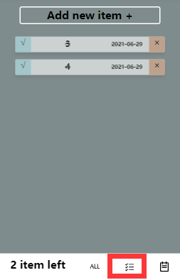

### Active

点击底部栏左侧的第三个按钮，将会显示所有进行中的Item。

在本例中为1、2、5。

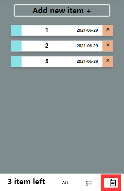

## Item 排序

### 时间排序

从前文的图片可以看出，程序对item的时间进行了排序。

这更贴近使用者的真实心理情况，即通常情况下更倾向于去做截止日期更前的待办事项。

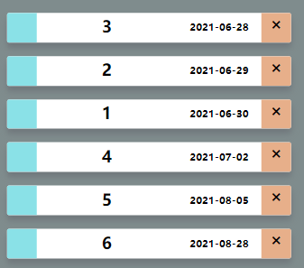

### 事项排序

同时，使用者更关注于未完成的事项。

如果一个item事项已经被完成，这时将会把它的顺序移到列表后方。

程序的综合排序风格结合了 `时间` 和 `是否完成`  两者进行排序。

在本样例中，事项1和4的时间虽然较前，但是已经完成，所以将被放置到末尾。

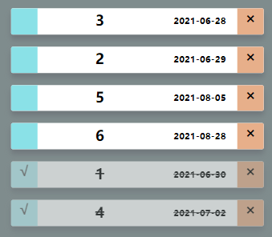

## Item搜索

在顶部操作栏输入关键字，点击右侧搜索icon

按下搜索按钮，出现列表结果：

在本样例中，输入关键字`2`，经过匹配得到的Item有`22`、`1123`、`2`，结果正确。

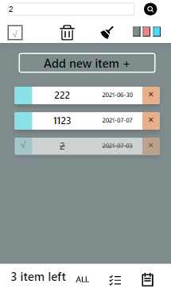

## Item风格

### 超时Item

当已经超出事项的截止日期，而该事项仍未被完成，此时需要强调该超时事项item。

程序使用加红日期，以达到强调的效果。

在本样例中，当前时间2021-06-25，均超出事项0和事项3的截止日期。

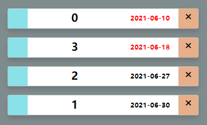

### 主题风格

在顶部操作栏右上角有3个颜色方框，分别表示了3种不同的主题风格。

初始默认灰色风格。

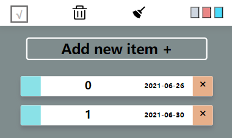

点击蓝色主题，页面将切换为蓝色主调。

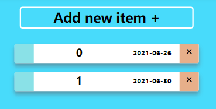

### 页面总览

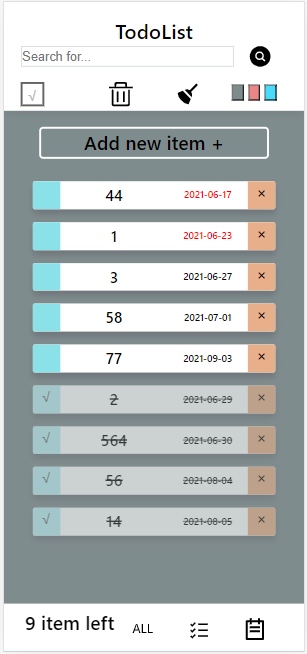

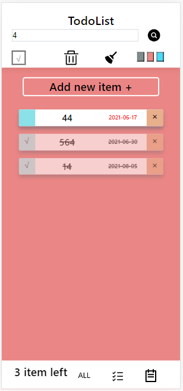

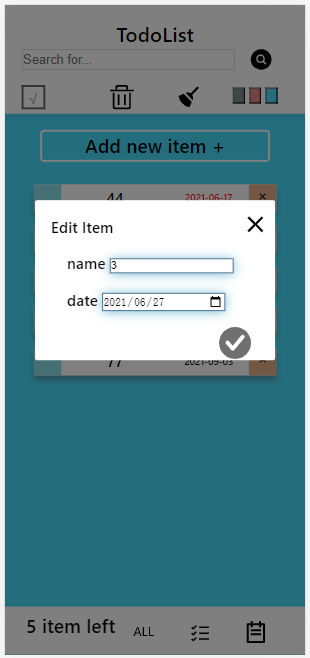

